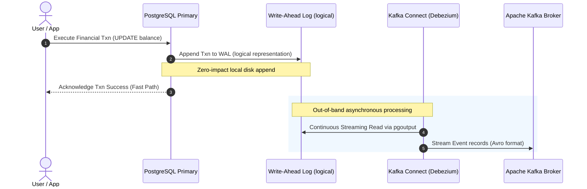

# Debezium CDC Connector for PostgreSQL (Core Banking System)

This guide documents the deployment, database preparation, and high-throughput tuning of the production-ready Debezium CDC connector configuration for an enterprise Core Banking System (CBS) running on **PostgreSQL 16**.

Designed to tail transactional ledger events under extreme peak loads (up to **150,000 peak TPS**) with **zero execution overhead** on online transactional processing (OLTP) tables.

---

## 🏗️ Architectural Overview & WAL Tailing Mechanics

Traditional query-based database pulling puts severe strain on operational tables due to constant polling, locks, and index lookups. Debezium CDC resolves this by **asynchronously tailing the PostgreSQL Write-Ahead Log (WAL)**.



### Zero-OLTP-Impact Guarantee
- **No Query Locks:** Debezium does not execute `SELECT` queries on the live tables during streaming. It consumes events out-of-band from the replication stream.
- **Sequential Disk I/O:** Reading the WAL is sequential disk I/O, which does not interfere with the database's buffer cache, indexes, or page layout.
- **Filtered Publications:** The logical publication is strictly limited to the `banking_ledger` and `account_balances` tables. Only changes to these tables are placed in the replication stream, minimizing CPU usage and memory footprint.

---

## 🗄️ Database Prerequisites (PostgreSQL 16)

Before deploying the connector, the PostgreSQL database must be configured for logical replication.

### 1. Primary Configuration (`postgresql.conf`)
Ensure the following parameters are set and the cluster is restarted:
```ini
# Enable logical decoding and replication streaming
wal_level = logical

# Allocate replication slots (minimum 1 per connector, recommend at least 10)
max_replication_slots = 10

# Allocate maximum wal senders (must be greater than or equal to active slots)
max_wal_senders = 10
```

### 2. Database Schema Preparations & Minimally Privileged User Setup
To comply with the principle of least privilege, do **NOT** run the connector as a superuser. Run the following commands as a DB administrator:

```sql
-- 1. Create a dedicated replication user
CREATE USER debezium_cdc_user WITH PASSWORD 'VaultDecryptedSecurePassword123!' REPLICATION;

-- 2. Grant usage privileges on the schema
GRANT USAGE ON SCHEMA cbs_ledger TO debezium_cdc_user;

-- 3. Grant select access on target financial tables
GRANT SELECT ON cbs_ledger.banking_ledger TO debezium_cdc_user;
GRANT SELECT ON cbs_ledger.account_balances TO debezium_cdc_user;

-- 4. Create filtered publication strictly isolating ledgers
CREATE PUBLICATION dbz_cbs_publication FOR TABLE cbs_ledger.banking_ledger, cbs_ledger.account_balances;

-- 5. Set replica identity to FULL to capture complete before-and-after states (mandatory for audits)
ALTER TABLE cbs_ledger.banking_ledger REPLICA IDENTITY FULL;
ALTER TABLE cbs_ledger.account_balances REPLICA IDENTITY FULL;
```

---

## 📝 Annotated JSON Configuration Manifest

Below is the annotated representation of [debezium-pg-cbs-connector.json](file:///c:/Users/Arnav%20Shirwadkar/Desktop/Mains/IntelliTrace/deploy/kafka/debezium-pg-cbs-connector.json) detailing the exact engineering rationale behind each parameter:

```javascript
{
  "name": "debezium-postgresql-cbs-connector", // Unique identifier in the Kafka Connect cluster
  "config": {
    /* ----------------------------------------------------
     * 1. Connector Base Class & Parallel Task Routing
     * ---------------------------------------------------- */
    "connector.class": "io.debezium.connector.postgresql.PostgresConnector",
    "tasks.max": "1", // Debezium PostgreSQL connector strictly uses 1 task to preserve strict ordering of WAL streams

    /* ----------------------------------------------------
     * 2. Vault-sourced Database Connection Details
     * ---------------------------------------------------- */
    "database.hostname": "pg-cbs-cluster-primary.internal", // Cluster primary endpoint
    "database.port": "5432",
    "database.user": "debezium_cdc_user", // Least-privileged user
    "database.password": "VaultDecryptedSecurePassword123!",
    "database.dbname": "core_banking_db",
    "topic.prefix": "cbs.cdc.prod", // Prefixes all topics. Output: cbs.cdc.prod.cbs_ledger.banking_ledger

    /* ----------------------------------------------------
     * 3. Logical Replication Plugin & Slot Settings
     * ---------------------------------------------------- */
    "plugin.name": "pgoutput", // Native logical output decoder in PG 10+
    "publication.name": "dbz_cbs_publication", // References the filtered publication we created
    "publication.autocreate.mode": "filtered", // Prevents creating publication if not matching targets
    "slot.name": "debezium_cbs_replica_slot", // Unique replication slot name to track WAL offset in DB

    /* ----------------------------------------------------
     * 4. Scope Isolation (Strict Schema/Table Include Lists)
     * ---------------------------------------------------- */
    "schema.include.list": "cbs_ledger", // Strictly process ledger schema
    "table.include.list": "cbs_ledger.banking_ledger,cbs_ledger.account_balances", // Isolate auditing ledgers

    /* ----------------------------------------------------
     * 5. Tombstones & Compaction Policies
     * ---------------------------------------------------- */
    "tombstones.on.delete": "false", // Disable tombstone markers on delete to maintain continuous ledger history

    /* ----------------------------------------------------
     * 6. High-Throughput Buffering & Scaling Optimizations (150k TPS)
     * ---------------------------------------------------- */
    "max.batch.size": "40960",  // Ingests up to 40,960 records in a single bulk transaction block
    "max.queue.size": "163840", // Internal buffer size (4x batch size) to absorb extreme database transaction bursts
    "poll.interval.ms": "20",   // Frequency of logical replication slot polling (milliseconds) for real-time reads

    /* ----------------------------------------------------
     * 7. Fail-Fast Audit Integrity & Logging
     * ---------------------------------------------------- */
    "errors.log.enable": "true", // Log exact serialization/network errors in standard error stream
    "errors.tolerance": "none",   // Fail-fast immediately. Ensures zero data loss or unvalidated schema corruptions downstream

    /* ----------------------------------------------------
     * 8. Active Connection Heartbeats (Prevents WAL Accumulation)
     * ---------------------------------------------------- */
    "heartbeat.interval.ms": "5000", // Regularly sends heartbeats to ensure PG primary advances the LSN even when idle
    "heartbeat.action.query": "SELECT 1;", // Low-impact verification query

    /* ----------------------------------------------------
     * 9. Numerical Precision & Serialization Modes
     * ---------------------------------------------------- */
    "decimal.handling.mode": "precise", // Ensures Decimals are serialized with full fractional scale (no IEEE-754 precision loss)
    "time.precision.mode": "connect", // Align time schemas to Connect frameworks

    /* ----------------------------------------------------
     * 10. Confluent Avro Schema Registry Converter Integration
     * ---------------------------------------------------- */
    "key.converter": "io.confluent.connect.avro.AvroConverter",
    "key.converter.schema.registry.url": "http://schema-registry.internal:8081",
    "value.converter": "io.confluent.connect.avro.AvroConverter",
    "value.converter.schema.registry.url": "http://schema-registry.internal:8081"
  }
}
```

---

## 🚀 Kafka Connect Deployment Guide (curl Commands)

Ensure your shell terminal has network access to the distributed Kafka Connect REST cluster endpoint (assumed running on `http://localhost:8083`).

### 1. Register/Create the CDC Connector
Run the following command to deploy the JSON manifest configuration:
```bash
curl -X POST \
  -H "Content-Type: application/json" \
  --data @debezium-pg-cbs-connector.json \
  http://localhost:8083/connectors
```

### 2. Verify Connector Status
Verify that the connector is actively running and has spawned its tasks successfully:
```bash
curl -s http://localhost:8083/connectors/debezium-postgresql-cbs-connector/status | jq
```

### 3. List Active Connectors
Confirm all running connectors on the Connect cluster instance:
```bash
curl -s http://localhost:8083/connectors | jq
```

### 4. Dynamic Configuration Update
If configuration parameters require alteration (e.g. scaling batch sizes or changing Registry URLs), execute a PUT request to override configuration settings dynamically:
```bash
curl -X PUT \
  -H "Content-Type: application/json" \
  --data @debezium-pg-cbs-connector.json \
  http://localhost:8083/connectors/debezium-postgresql-cbs-connector/config
```

### 5. Restart Failed Tasks
If a task fails (e.g., database network timeout or schema Registry loss), restart task `0` directly using:
```bash
curl -X POST http://localhost:8083/connectors/debezium-postgresql-cbs-connector/tasks/0/restart
```

### 6. Pause & Resume Streaming (Operational Maintenances)
Pause ingestion streams gracefully before performing database cluster failovers or registry maintenances:
```bash
# Pause the Connector
curl -X PUT http://localhost:8083/connectors/debezium-postgresql-cbs-connector/pause

# Resume the Connector
curl -X PUT http://localhost:8083/connectors/debezium-postgresql-cbs-connector/resume
```

### 7. Gracefully Delete the Connector
Tear down the connector instances while keeping historical offsets preserved in PostgreSQL metadata replication slots:
```bash
curl -X DELETE http://localhost:8083/connectors/debezium-postgresql-cbs-connector
```
